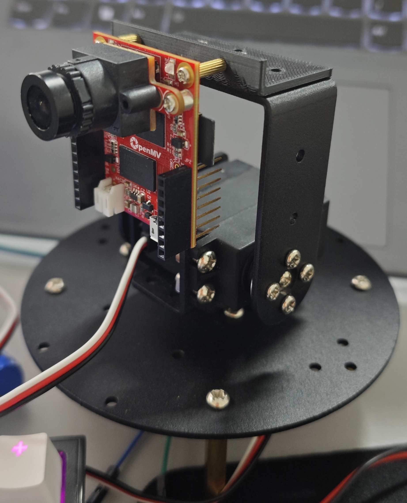
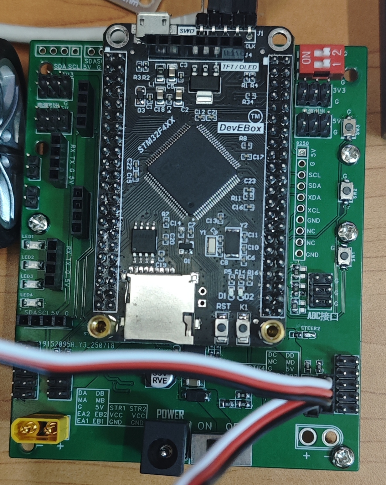

# 项目名称：Openmv识别并追踪色块
## 介绍：
- 本项目视觉部分由
__OpenMV__
及官方固件库构成，通过官方的库函数进行色块识别。云台使用
__STM32F407VET6__
作为主控进行控制。Openmv_H7_Plus与F407之间采用串口通信传输色块信息，再在F407中进行追踪逻辑的实现。

## 云台实物图：
- 云台使用的是舵机云台，活动范围是270°，云台与舵机之间的转接座是3D打印部件，用m2铜柱进行连接。
- 3D打印转接座打印文件 -> [云台转接座](3D)

## 舵机主控板实物图:
- 主控使用到的芯片是F407，并且拓展板上有单独的两个舵机电源模块，使用12V直流电源驱动。拓展板上还有多个串口引出，方便调试连接上位机。

